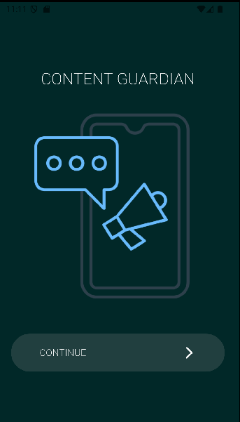
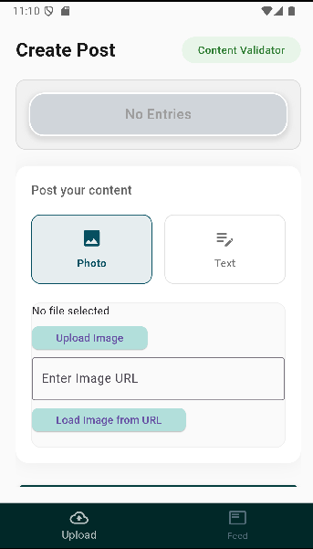
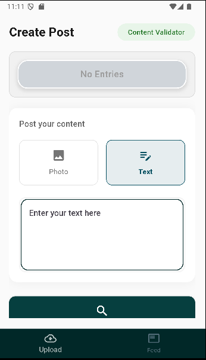
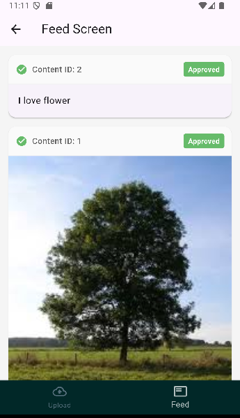

# Offensive Speech and Unsafe Image Detection App

## Overview

This Flutter application is designed to detect and filter offensive speech and Unsafe (Not Safe For Work) images. Users can input text and upload images, and the app will analyze the content for appropriateness. If the content is deemed safe, users can post it to the feed, where it will be visible to others.

## Features

- **Offensive Speech Detection**: The app analyzes user-inputted text for offensive language and provides feedback accordingly.
- **Unsafe Image Detection**: Users can upload images, which will be scanned for inappropriate content.
- **Content Approval**: Safe images and text can be posted to the feed,allowing users to share it in Feed Screen.
- **Feed Screen**: Users can view the approved content.
### API :
- **API Integration**: The app includes an API for enhanced functionality ( OffensiveSpeechAPI & UnsafeImageAPI ).

Content_Safeguard_Models_API Repo : https://github.com/sabsar42/content_safeguard_model_api/tree/main

#### VIDEO : [ https://www.youtube.com/watch?v=YzBwc_2c2Eg ]

